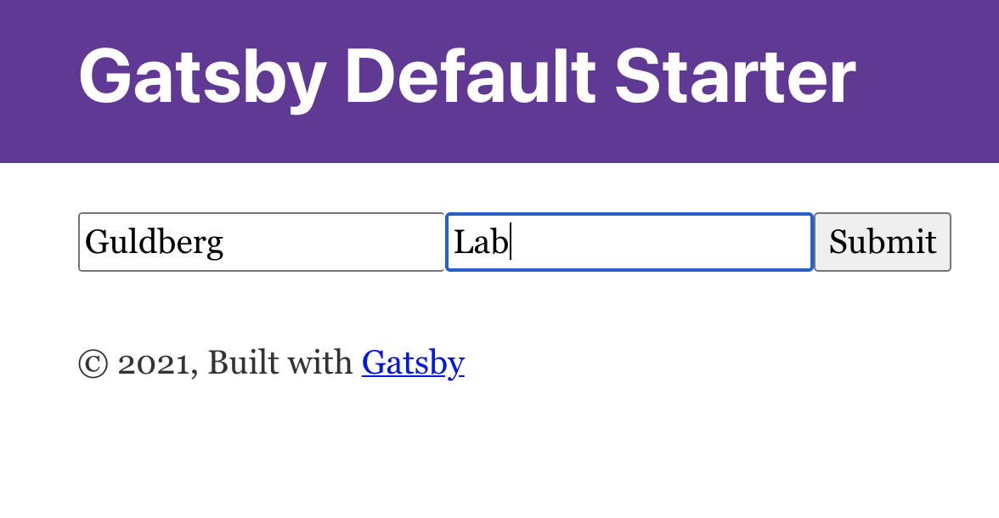

I am currently rewriting a 10+ year old website written in `ASP.NET` to `React/GatsbyJS`. The website had multiple forms with more than 50 input fields, some which could be omitted but a large portion of the inputfields is vital for the price caluclation.  
Recently I discovered [ react-hook-form ](https://react-hook-form.com/) which is very intutive to work with, minimizes the number of re-renders and in general just make it much more pleasant to work with forms, I will probably write a small tutorial in the future to show how I use it.  
  
However, the decision to split the huge form into a form with steps was quickly made but I had no idea how this in reality should be implemented. After some thoughts on the problem I decided to use gatsby's `dynamic routes` and `recoil` to manage the state. 

## Create a project
First of all we need a brand new gatsby project, for this demo I am going to use the default gatsby starter, I would advice any one who starts a new gatsby project to start to from scratch to have the most control an knowlgde about the project.

```bash
gatsby new multiform https://github.com/gatsbyjs/gatsby-starter-default
```


```sh
yarn add recoil @reach/router react-hook-form
```


We now have project with the following structure:
```
.
├── LICENSE
├── README.md
├── gatsby-browser.js
├── gatsby-config.js
├── gatsby-node.js
├── gatsby-ssr.js
├── package-lock.json
├── package.json
└── src
    ├── components
    │   ├── header.js
    │   ├── layout.css
    │   ├── layout.js
    │   └── seo.js
    ├── images
    │   ├── gatsby-astronaut.png
    │   └── gatsby-icon.png
    └── pages
        ├── 404.js
        ├── index.js
        ├── page-2.js
        └── using-typescript.tsx
```


## Create form steps 
We are going to use the index page to display the form, the first thing we are going to create the [clien-only routes](https://www.gatsbyjs.com/docs/how-to/routing/client-only-routes-and-user-authentication).

We are going to create three steps in our form, `Step1` which contains first and last name, `Step2` which has an email field and the last step is going to be a `Summary`, I won't go into the details about how `recoil` works, but if you wan't know more about it you can [read this post](jdskal) which explains how it can be implemented in Gatsby.


```jsx
import { navigate } from 'gatsby'
import React from 'react'
import { useForm } from 'react-hook-form'
import { useRecoilState } from 'recoil'
import { formState } from './state'
 
export const Step1 = () => {
    const { register, handleSubmit } = useForm()
    const [formData, setFormData] = useRecoilState(formState)

    const onSubmit = (data) => {
        setFormData({...data })
        navigate('/form/step2')
    }

    return (
        <form onSubmit={handleSubmit(onSubmit)}>
            <input type='text' {...register('first_name')} placeholder='first name'/>
            <input type='text' {...register('last_name')} placeholder='last name'/>
            <input type="submit" />
        </form>

    )
}

export const Step2 = () => {
    const { register, handleSubmit } = useForm()
    const [formData, setFormData] = useRecoilState(formState)

    const onSubmit = (data) => {
        setFormData({...formData, ...data })
        navigate('/form/summary')
    }

    return (
        <form onSubmit={handleSubmit(onSubmit)}>
            <input type='email' {...register('email')} placeholder='email'/>
            <input type="submit" />
        </form>

    )
}


export const FormSummary = () => {
    const [formData, setFormData] = useRecoilState(formState)
    return <div><pre>{JSON.stringify(formData, null, 2) }</pre></div>;
}
```

## Implement client-only routes
Theese are the three steps we are going to use, the next thing is to create a page for our form, I am going to create a `form.js` page in the `/src/pages` like this

```js
import React from 'react'
import Layout from "../components/layout"
import { Router } from "@reach/router"
import { FormSummary, Step1, Step2 } from "../components"

const FormPage = () => {

  return (
  <Layout>
    <Router>
      <Step1 path='/form/step1' />
      <Step2 path='/form/step2'/>
      <FormSummary path='/form/summary'/>
    </Router>
  </Layout>)
}

export default FormPage
```

Starting the project now won't actually do anything, we need to create the `client-only` routes through `gatsby-node.js` in order to "activate" the routes we defined within the form page.
If you wan't to know how this work I suggest you read the [docs](https://www.gatsbyjs.com/docs/how-to/routing/client-only-routes-and-user-authentication).

```js
exports.onCreatePage = async ({ page, actions }) => {
  const { createPage } = actions

  if (page.path.match(/^\/form/)) {
    page.matchPath = `/form/*`
    createPage(page)
  }
}
```

## Demo

Starting the project and going to `/form/step1` should show two input fields and a submit button: 




The full source code can be found [here](link to repo)
